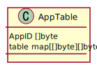

# 신뢰할 수 있는 분산된 네트워크

## 전체 네트워크 다이어그램

네트워크는 여러개의 릴레이 노드로 이루어지고 각 릴레이 노드는 여러개의 리프노드를 가집니다.  
각 리프 노드는 자기만의 해시 아이디를 가지고 어떤 릴레이 노드에 접속해 있더라도 온라인 상태면 메시지를 받을 수 있습니다.

## Message

메시지는 리프 노드가 작성하여 다른 리프 노드에 전송합니다.  
일단 전송된 메시지는 단일 혹은 여러 릴레이 노드를 거쳐 목표 리프 노드에 도착하게 됩니다.

KEMTLS를 사용하게 될 것이므로 미리 공개된 공개키와 자신의 개인키를 사용하여 만든 키를 사용하여 암호화한 데이터와 시크릿 키를 포함하여 전송합니다.

## CT Log

CT 로그는 리프 노드가 자신의 증명을 위해 사용됩니다.  
리프 노드가 처음 네트워크에 접근할 때 신뢰할 수 있는 릴레이 노드에게 자신이 생성한 공개키를 전송하여 해시 아이디를 발급받고 CT 로그를 작성합니다.  
각각 이 로그가 유효한 시점과 만료 시점을 유닉스 타임으로 저장하고 가장 마지막에 접근했을 때 상태를 저장합니다.  
리프 노드가 다른 리프 노드에게 메시지를 보낼 때 릴레이 노드에게 CT 로그를 받아서 유효한지 파악한 후 키교환을 진행합니다.

CT 로그를 통해 사용자의 해시 아이디가 중복되는지 파악하여 유일성을 확보합니다.  
또 KEMTLS를 사용하여 키교환을 하기에 공개키를 저장하는 역할도 합니다.

## App Table

## Trap

